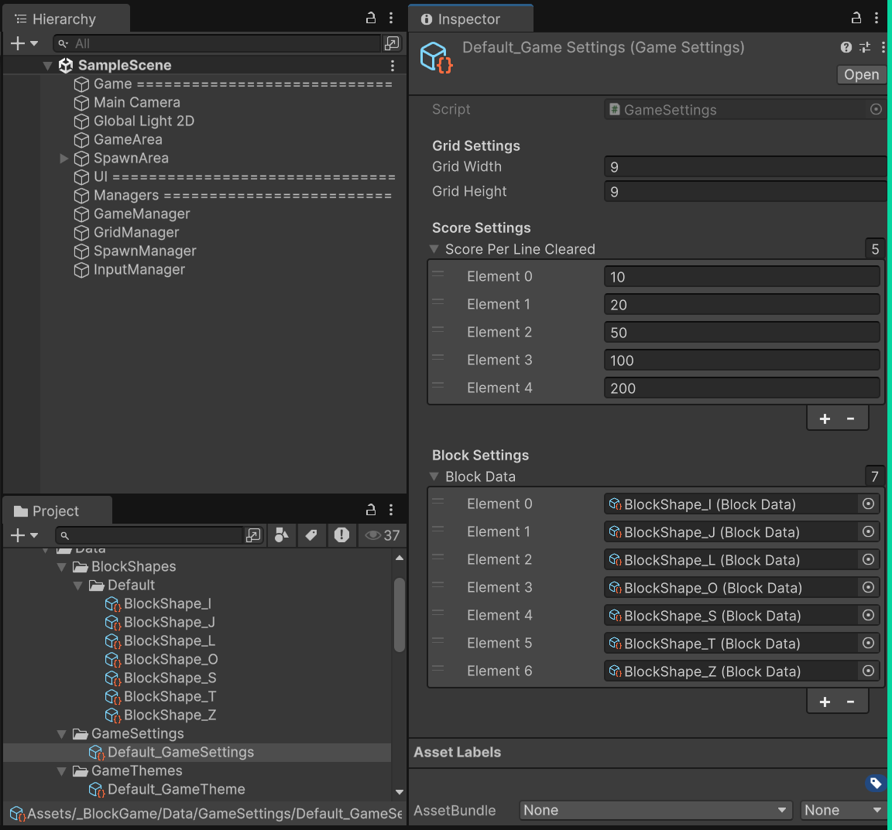
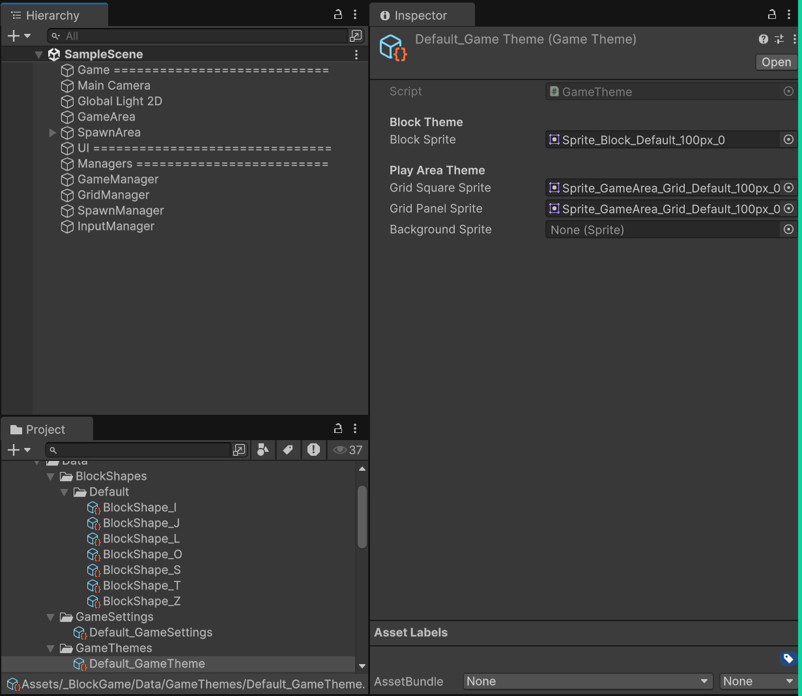
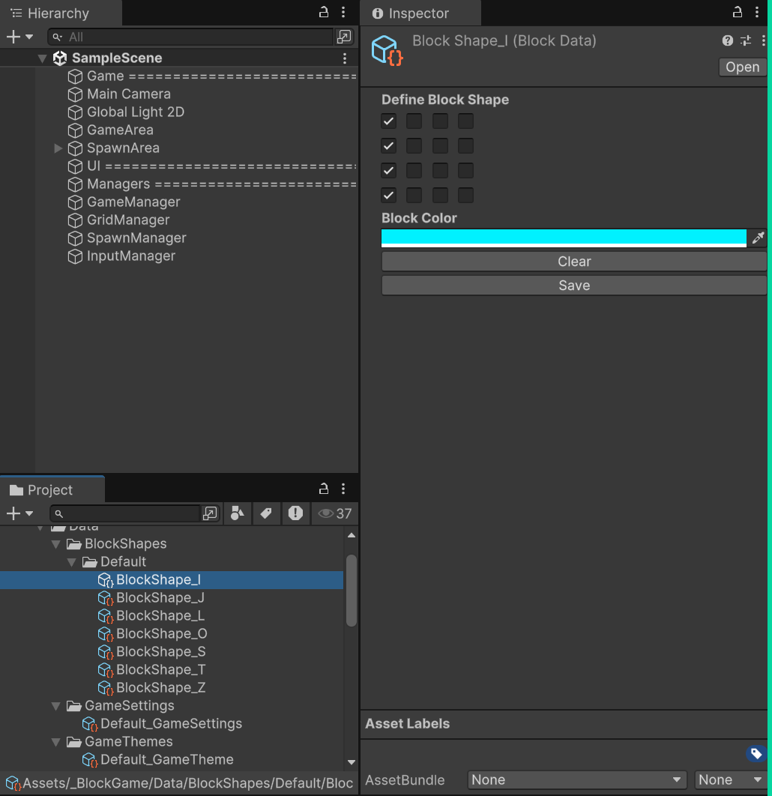
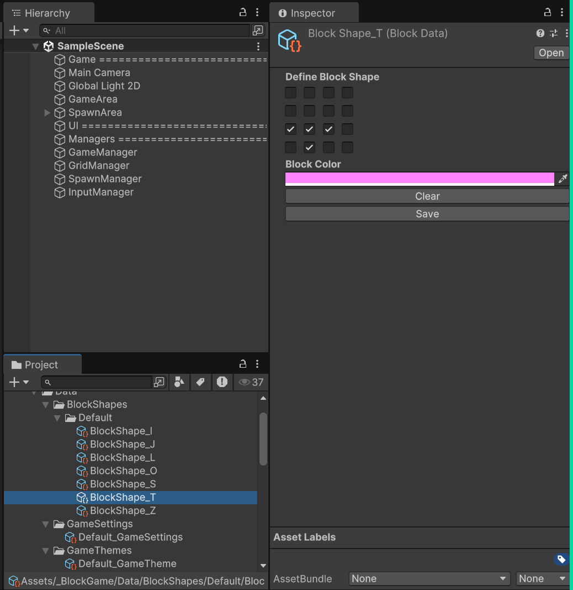
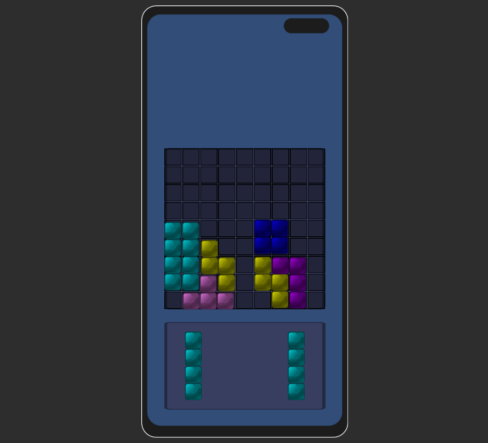

# Block Game Art Test Project

## Implementation checklist
### Done
<ul> 
    <li>Game Settings and Themes Framework</li>
        <ul>
            <li>Flow to configure game settings (grid, score per line cleared, and eligible block data)</li>
            <li>Flow to configure game visuals via SO (sprites of gameplay elements)</li>
        </ul>
    <li>Tetromino Block Framework</li>
        <ul>
            <li>Scriptable object-based data oriented instancing</li>
            <li>Spawning 3 blocks at a time whenever the user has placed all three</li>
            <li>OnTouch, OnDrag, OnDrop handlers</li>
        </ul>
    <li>Scoring system</li>
    <li>Game over condition</li>
    <li>Serialization (local highscore saving)</li>
</ul>

### To do
<ul>
    <li>Canvas UI</li>
        <ul>
            <li>Score and highscore view</li>
            <li>Game over panel</li>
        </ul>
    <li>Line clear logic</li>
    <li>Visuals + Polish</li>
        <ul>
            <li>Animations/particles on line clear</li>
            <li>Score animations</li>
            <li>Menu and panels animations</li>
            <li>Sound FX</li>
        </ul>
    <li>Automatic adjustment of play area based on device screen resolution / aspect ratio</li>
</ul>

### Samples / Preview
**Game Settings Default SO**

**Game Theme Default SO**

**I Block Data SO**

**T Block Default SO**

**Actual Game - Day 01 Progress**
